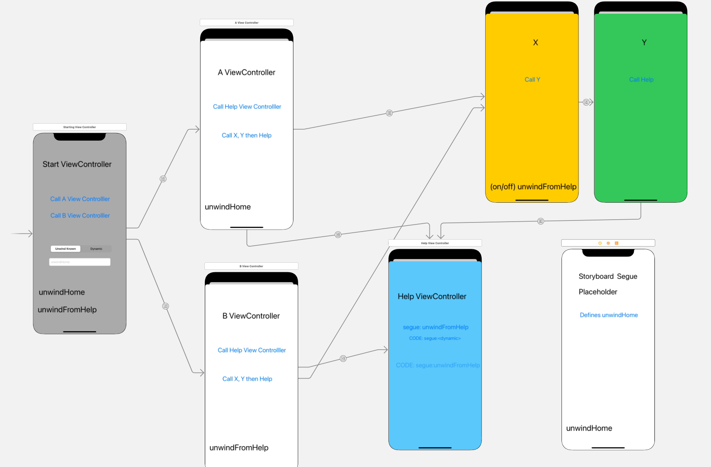
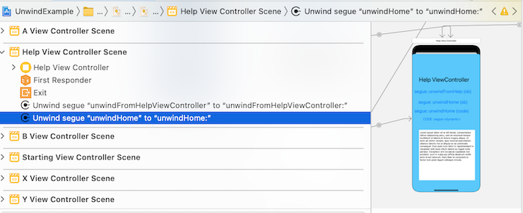
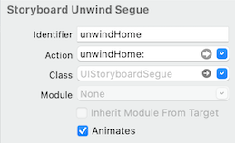
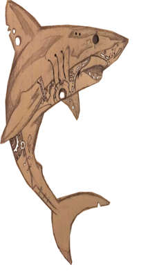

# Unwinding View Controller testing



`UnwindExample` is testing framework for the "unwindSegue" method. The goal is 
to see if the unwind method can unwind to a method that wasn't explicently connected
via a storyboard.

Instead, a placeholder method, defined in the Unused Placeholder view controllers. It is also
manually connected to via the storyboard exit method. In this example two methods are defined:
* unwindFromHelpViewController
* unwindHome

The reason there needs to be an unwind that isn't in the normal path is this will be provided by the new program reusing all this code. Thus the 'unwindHome' could be that method that isn't called in the example, but when a user created a 'home' they implement 'unwindHome' and when the "HelpViewController" is eventually called, the exit to 'unwindHome' would go to this new code; implementing the concepts of delegation through an interesting method.

The key to this is insight gained by the post: <a href="https://stackoverflow.com/questions/12561735/what-are-unwind-segues-for-and-how-do-you-use-them">Unwind Segues</a>

In particular, the concept that the unwind methods are to define where they come from (eg. HelpViewController) not where they are going to. Thus HelpViewController only knows of a segue called 'unwindHome - but doesn't know the implementor yet. But the storyboard has an UISegue defined for this entry.

When view controllers are pushed on the navigation stack (or equilivent), the runtime engine must keep track of the unwind methods. So there can be many with the same name, but only those in this virtual stack of view controllers, will be called.

This test shows this as getting to HelpViewController and then unwinding, will perform different amounts of unwinding depending on how it got there.


## Features
* Tests various paths/ways of getting to the HelpViewController, and unwinding to different unwind methods depending on the path and what is desired (eg. unwindHome or unwindFromHelpViewController.

## System Requirements
iOS 8.0 or above

## Installation

The steps describe elsewhere show how to make connection from a button to an 'exit' - and it pics a method that was defined somewhere in the project. In the example below, 'unwindHome' is one of those. 

Note that if the call is made totally from the storyboard, then the identifier doesn't have to be explicitly defined.

But if an in-line code version is to be used, the identifier of the segue must be defined.

And the unwind segue identifier must be defined.


#### Objective-C


```objc
//!define the unwindFromHelp - called "unwindHome"
- (IBAction) unwindHome:(UIStoryboardSegue*)unwindSegue
{
    UIViewController *destVC = unwindSegue.destinationViewController;
    UIViewController *sourceVC = unwindSegue.sourceViewController;
    NSLog(@"Sart:Unwinding unwindHome %@, %@, %@", unwindSegue, destVC, sourceVC);
}
```


In order for a code version to work, the identifier must be defined, and it's this identifier (not the method name) that is used. So even if 'unwindHome:' was the method connected via the xcode tool, an identifier (like 'unwindHome') must be defined.


```objc
//!unwind to a known identifire of a segue
- (IBAction)unwindInCodeCalled:(id)sender {

   // maybe decide which one to call by a state variable
   if (callUnwind)
      [self performSegueWithIdentifier:@"unwindHome" sender:self];
   else
      [self performSegueWithIdentifier:@"unwindFromHelpViewController" sender:self];

}
```

Unfortunately calling the code with a constant, like unwindHome, still crashes if the identifer wasn't defined.

```objc
'NSInvalidArgumentException', reason: 'Receiver (<HelpViewController: 0x7ff34671ed10>) has no segue with identifier 'unwindHome''
```

NOTE: the Storyboard Unwind Segue must be created in the Storyboard tool. So it needs an Action, which is why the unused placeholde is valuable. You must also add an SegueIdentifier so it can be retrieved in the "performSegueWithIdentifier' call.

Also: the segue must have an Identifier (like unwindHome) and an action (like unwindHome:) otherwise the dynamic version, where performSegueWithIdentifier is used, won't work (as there is no identifier matching).

#### Proudly powering apps by

[KnowledgeShark.me](https://knowledgeshark.me)

